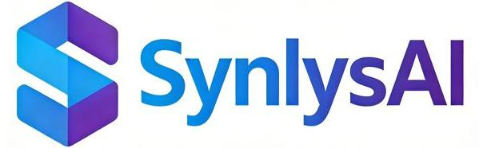

# SynlysAI
Where AI meets lab automation to supercharge materials science.

## Team Profile

SynlysAI is a pioneering high-tech research team at the intersection of AI and laboratory automation, dedicated to redefining materials and chemical research paradigms. Our interdisciplinary team—specializing in AI algorithms, materials science, chemical engineering, and robotic systems integration—combines deep domain expertise with innovative thinking to merge cutting-edge technologies with scientific exploration, advancing intelligent lab research.

We focus on AI-powered autonomous laboratory solutions, building robot-assisted self-driving systems for materials/chemical synthesis, characterization, and analytical development. By integrating machine learning, adaptive robotics, and real-time data analytics, we create closed-loop intelligent lab ecosystems that eliminate inefficiencies of manual experimentation. Our work enables seamless integration of experimental design, automated execution, characterization, and data-driven optimization, helping researchers accelerate discovery, reduce resource use, and push new frontiers in materials and chemical science.

## Vision

We aim to become a global leader in AI-driven laboratory automation, transforming how materials and chemicals are discovered and developed. We envision a future where our AI-powered, robot-assisted autonomous systems replace traditional trial-and-error research, enabling unprecedented speed, precision, and sustainability in scientific innovation.

By equipping researchers worldwide with intelligent tools to turn theoretical predictions into tangible solutions, we strive to accelerate breakthroughs in renewable energy materials, advanced functional materials, pharmaceutical chemistry, and green chemicals—addressing global challenges and building a more sustainable, innovative future for humanity.

## Core Technologies

- AI Algorithm Development
- Materials Science Research
- Chemical Engineering
- Robotic System Integration
- Machine Learning
- Adaptive Robotics
- Real-time Data Analytics
- Closed-loop Intelligent Lab Ecosystems

## Application Areas

- Renewable Energy Materials
- Advanced Functional Materials
- Pharmaceutical Chemistry
- Green Chemicals

## Contact Us

