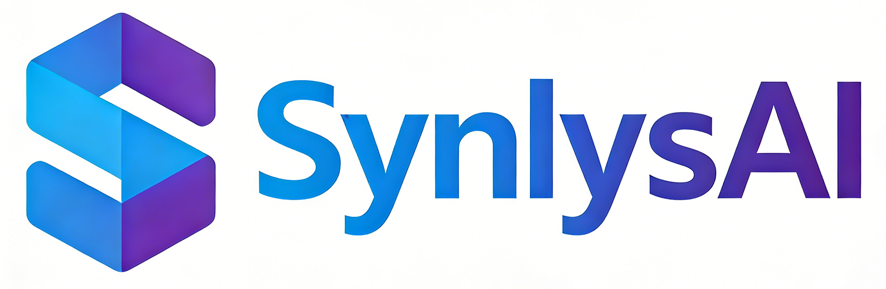
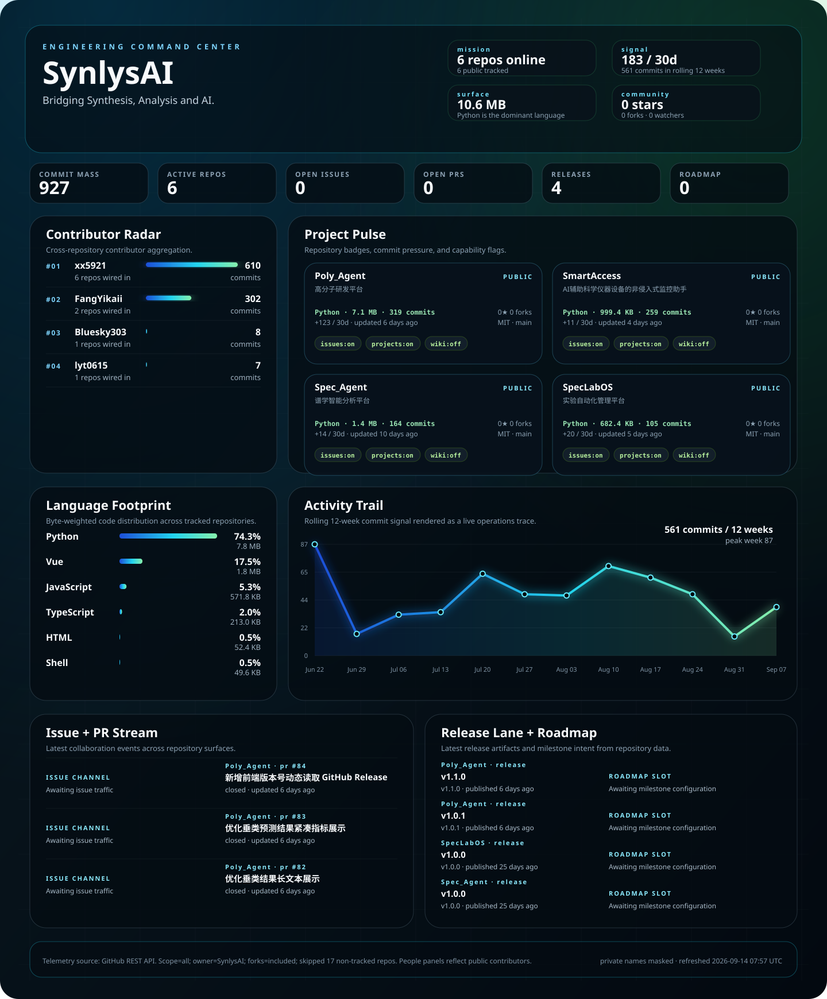

[English](README.en.md) | [简体中文](README.md)

# SynlysAI

*连接合成、分析与 AI。*

SynlysAI 是一家 AI for Science（AI4S）组织，聚焦自主实验、智能仪器与面向化学和材料研究的闭环发现。我们在机器学习、机器人、科学工作流与领域知识的交叉点上，构建能够以最少人工干预完成实验规划、执行、观测与优化的系统。

我们的目标不仅是构建有用的软件，更是帮助定义 AI 原生实验室的新研究范式：让数据生成、决策制定与实验控制深度集成。

## 研究方向

- 面向材料与化学发现的自主实验室
- 用于实验设计与自适应优化的机器学习系统
- 覆盖合成、表征与分析的科学工作流编排
- 支撑闭环实验执行的机器人感知基础设施
- 面向光谱、成像与多模态科学信号的 AI 原生数据管道

## 开源雷达

## 正在构建

我们正在为需要超越孤立模型的 AI4S 研究团队构建开放的技术基础，包括：

- 面向科学机器学习与优化的研究代码
- 连接 AI 系统与实验室仪器之间的接口
- 用于光谱分析与实验反馈循环的分析工具
- 可复现的、以数据为中心的科学自动化基础设施

## 合作

我们欢迎围绕以下方向开展开放合作：

- 面向材料与化学的 AI
- 自动驾驶实验室系统
- 自主实验平台
- 科学基础模型与多模态实验室数据
- 面向 AI 驱动发现的可复现基础设施

如果你的工作与上述方向相关，本组织将作为一个可见的、持续演进的科研平台，而不是一个静态的实验室主页。

## 联系方式

